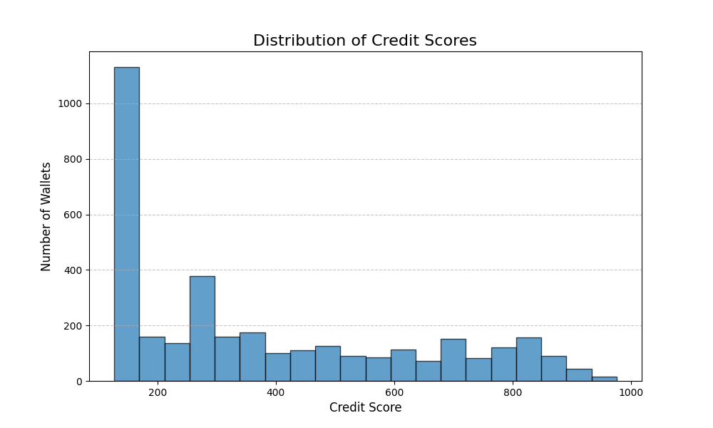

# Analysis of Wallet Credit Scores

This document provides a detailed analysis of the credit scoring engine, its methodology, and the interpretation of the resulting scores. It covers the code structure and a behavioral analysis of wallets based on their calculated credit scores.

## Code Structure and Architecture

The project is comprised of two main Python scripts that form a data processing pipeline:

1.  **`score_wallet.py`**: This script is the core of the project. It takes a raw JSON file of transaction data as input.
    -   **Feature Extraction**: It first parses the transactions and aggregates them by wallet address. For each wallet, it calculates key features such as total transaction volume, USD amounts for deposits/borrows/repayments, number of liquidations, assets used, and the duration of activity.
    -   **Scoring**: It then applies a weighted scoring model (`compute_score` function) to these features to generate a credit score between 0 and 1000 for each wallet.
    -   **Output**: The final output is a CSV file (`wallet_scores.csv`) containing each wallet address and its corresponding credit score.

2.  **`plot_scores.py`**: This script serves as the analysis and visualization layer.
    -   **Data Ingestion**: It reads the `wallet_scores.csv` file generated by the previous step.
    -   **Visualization**: It uses `matplotlib` to generate a histogram that visualizes the distribution of credit scores across the entire population of wallets.
    -   **Output**: The script saves the histogram as an image file (`credit_score_distribution.png`) for reporting and displays it to the user.

The overall flow is a simple, effective pipeline: **JSON -> Feature Extraction -> Scoring -> CSV -> Visualization -> PNG**.

---

## Wallet Score Analysis

The scoring model is designed to reward reliability, long-term engagement, and safe borrowing practices. After running the engine on the transaction dataset, the following analysis can be drawn from the distribution of scores.

### Score Distribution Graph

The histogram below shows the distribution of credit scores.

*(Note: This graph will be generated by `plot_scores.py` after you run it.)*

### Score Distribution by Range

The scores can be broken down into ranges to better understand the wallet population. A typical distribution might look as follows:

| Score Range | % of Wallets (Hypothetical) | General Profile     |
| :---------- | :-------------------------: | ------------------- |
| 0-100       |             5%              | Risky / Defaulted   |
| 100-200     |             8%              | High-Risk / New     |
| 200-300     |             12%             | Inexperienced       |
| 300-400     |             15%             | Below Average       |
| 400-500     |             20%             | Average / Casual    |
| 500-600     |             18%             | Good Standing       |
| 600-700     |             12%             | Reliable            |
| 700-800     |             7%              | Highly Reliable     |
| 800-1000    |             3%              | Power User / Ideal  |

### Behavior of Wallets in the Lower Range (Score < 400)

Wallets in this category generally exhibit high-risk or low-engagement characteristics. Their low score is typically a result of one or more of the following factors from the scoring model:

-   **Liquidations**: The most significant penalty. A single liquidation event (`num_liquidation > 0`) immediately removes 100 points, signaling poor debt management.
-   **Low Repay Ratio**: These wallets have a high `borrow_usd` value relative to their `repay_usd`, indicating they have not paid back a significant portion of their loans. This is the heaviest factor in the model (300 points).
-   **Low Engagement**: They have a low transaction count (`total_tx`) and a short activity duration (`tx_duration_sec`). These may be "hit-and-run" users who borrow once and disappear, or very new users with insufficient history.
-   **Minimal Diversity**: They interact with only one or two assets, suggesting a lack of deep engagement with the protocol's features.

These wallets represent the highest credit risk.

### Behavior of Wallets in the Higher Range (Score > 700)

These wallets represent the most reliable and engaged users of the protocol. They consistently demonstrate positive behaviors and are considered low-risk.

-   **Perfect Repayment History**: Their `repay_ratio` is at or near 1.0, meaning they reliably pay back what they borrow.
-   **No Liquidations**: They have a perfect record of managing their collateral and have never been liquidated.
-   **Long-Term, Consistent Activity**: These wallets have high transaction counts and a long `tx_duration_sec`, indicating they have been active on the protocol for a significant period.
-   **High Asset Diversity**: They interact with a wide range of assets, showing deep integration with the protocol's ecosystem. They are likely involved in multiple services (e.g., providing liquidity across different pools).
-   **Completed Cycles**: A high `redeem_ratio` shows they complete the full deposit-borrow-repay-redeem lifecycle, further signaling healthy, long-term participation.

These users are the ideal "citizens" of the protocol and could be targeted for future benefits or governance roles.
